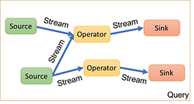

[](index.md)

## The basics



A streaming application runs a **query**, a directed acyclic graph of **sources**, **operators** and **sinks** connected by **streams**:

1. Sources produce tuples.
2. Operators consume input tuple and produce output tuples.
3. Sinks consume tuples.

When you create your query, you add sources, operators and sinks and connect them with streams.

#### A first example (complete example [here](https://github.com/vincenzo-gulisano/Liebre/blob/master/src/main/java/example/SimpleQuery.java))

In this example, a source creates a stream of tuples with attributes _&lt;timestamp,key,value&gt;_ and feeds them to an operator that multiplies the value by 2. This operator feeds its output tuples to a sink that prints them.


```java
class MyTuple implements Tuple {
	public long timestamp;
	public int key;
	public int value;

	public MyTuple(long timestamp, int key, int value) {
		this.timestamp = timestamp;
		this.key = key;
		this.value = value;
	}
}

Query q = new Query();

StreamKey<MyTuple> inKey = q.addStream("in", MyTuple.class);
StreamKey<MyTuple> outKey = q.addStream("out", MyTuple.class);

q.addSource("inSource", new BaseSource<MyTuple>() {
	Random r = new Random();

	@Override
	protected MyTuple getNextTuple() {
		Util.sleep(100);
		return new MyTuple(System.currentTimeMillis(), r.nextInt(5), r
			.nextInt(100));
	}
}, inKey);

q.addOperator("multiply", new BaseOperator<MyTuple, MyTuple>() {
	@Override
	protected List<MyTuple> processTuple(MyTuple tuple) {
		List<MyTuple> result = new LinkedList<MyTuple>();
		result.add(new MyTuple(tuple.timestamp, tuple.key,
			tuple.value * 2));
		return result;
	}
}, inKey, outKey);

q.addSink("outSink", new BaseSink<MyTuple>() {
	@Override
	protected void processTuple(MyTuple tuple) {
		System.out.println(tuple.timestamp + "," + tuple.key + ","
			+ tuple.value);
	}
}, outKey);

q.activate();
Util.sleep(30000);
q.deActivate();
```

Please notice:

1. You start defining a class for your tuples, which implements the _Tuple_ interface.
2. You can add streams to your query using the method _addStream_, providing an id for the stream and the class for the type of tuples that will be added and read from it. This method returns you a key you will use later on when adding sources, operators and sinks.
3. You can add a source to your query using the method _addSource_. For this method, you provide:
	- an id for the source.
	- an instance of _BaseSource_, for which you specify the method _getNextTuple_.
	- the key of the stream to which the tuples produced by the source will be added.
4. You can add an operator to your query using the method _addOperator_. For this method, you provide:
	- an id for the operator.
	- an instance of _BaseOperator_, for which you specify the method _processTuple_. The _BaseOperator_ allows you to return more than one tuple for each incoming tuple. If no tuple is returned, the method can return an empty list.
	- the key of the stream from which tuples are read by the operator.
	- the key of the stream to which tuples are added by the operator.
5. You can add a sink to your query using the method _addSink_. For this method, you provide:
	- an id for the sink.
	- an instance of _BaseSink_, for which you specify the method _processTuple_.
	- the key of the stream from which tuples are read by the sink.
6. You can activate and de-activate the query with methods _activate_ and _deactivate_.
